# Computer vision
> 컴퓨터 비전에 fastai 라이브러리 사용하기

이 튜토리얼은 대부분의 컴퓨터 비전 작업에서 [Learner](https://docs.fast.ai/learner.html#Learner)를 빠르게 구축하고 사전 훈련된 모델을 미세 조정하는 방법을 강조합니다.

# 단일 레이블 분류
이 작업을 위해 서로 다른 37가지 품종의 고양이와 개의 이미지가 포함된 [Oxford-IIIT Pet Dataset](https://www.robots.ox.ac.uk/~vgg/data/pets/)을 사용합니다. 먼저 간단한 cat-vs-dog 분류기를 구축하는 방법을 보여주고 모든 품종을 분류할 수 있는 좀 더 심화된 모델을 보여줍니다.

다음 코드를 통해 데이터 세트를 다운로드하고 압축을 풀 수 있습니다.
```
path = untar_data(URLs.PETS)
```

이 명령어는 다운로드를 한 번만 수행하고 압축 해제된 아카이브의 위치를 반환합니다. [.ls()] 메서드를 통해 내부에 무엇이 있는지 확인할 수 있습니다.
```
path.ls()
```

지금은 주석 폴더를 무시하고 이미지 폴더에 집중하겠습니다. [get_image_files](https://docs.fast.ai/data.transforms.html#get_image_files)은 하나의 폴더에서 모든 이미지 파일을 (재귀적으로) 가져오는 데 도움을 주는 fastai 함수입니다.
```
files = get_image_files(path/"images")
len(files)
```
```
7390
```

# 고양이 vs 개
고양이 대 개 문제에 대한 데이터에 레이블을 지정하려면 어떤 파일 이름이 개 사진이고 어떤 파일 이름이 고양이 사진인지 알아야 합니다. 구별하는 쉬운 방법이 있습니다: 파일 이름은 고양이의 경우 대문자로 시작하고 개는 소문자로 시작합니다.
```
files[0],files[6]
```
```
(Path('/home/jhoward/.fastai/data/oxford-iiit-pet/images/great_pyrenees_173.jpg'),
 Path('/home/jhoward/.fastai/data/oxford-iiit-pet/images/staffordshire_bull_terrier_173.jpg'))
 ```
 
 그런 다음 간단하게 레이블 함수를 정의할 수 있습니다.
 ```
 def label_func(f): return f[0].isupper()
 ```
 
모델에 대한 데이터를 준비하려면 [DataLoaders](https://docs.fast.ai/data.core.html#DataLoaders) 객체에 데이터를 넣어야 합니다. 파일 이름을 사용하여 레이블을 지정하는 함수인 [ImageDataLoaders.from_name_func](https://docs.fast.ai/vision.data.html#ImageDataLoaders.from_name_func)를 사용합니다. 당신의 문제에 더 적합할 수 있는 ImageDataLoaders의 다른 factory method가 있으므로 vision.data에 있는 모든 것들을 확인하세요. 
```
dls = ImageDataLoaders.from_name_func(path, files, label_func, item_tfms=Resize(224)) 
```
작업 중인 디렉터리의 경로, 가져온 파일들, label_func 함수 및 마지막 파라미터로 item_tfms를 이 함수에 전달했습니다. 이것은 데이터셋에 있는 모든 항목들에 대해 이미지를 224 x 224 크기로 조정하는 Transform입니다. 사각형으로 만들기 위해 가장 큰 치원에 대해 random crop을 적용하고 그 다음 224 x 224로 크기를 조정합니다. 만약 이것을 전달하지 못했다면 항목들을 일괄적으로 묶는 것은 불가능하기 때문에 나중에 오류를 얻게 됩니다.
 
그런 다음 show_batch 메서드에서 모든 것이 정상적으로 보이는지 확인할 수 있습니다(참은 고양이용, 거짓은 개용).
```
dls.show_batch()
```

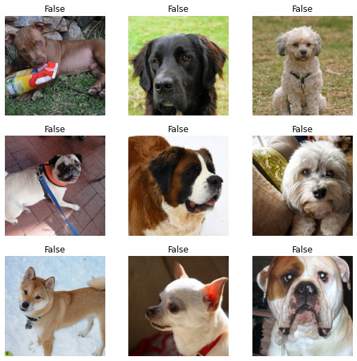

그런 다음 Learner를 만들 수 있습니다. Learner는 데이터와 훈련용 모델을 결합하고 전송 학습을 사용하여 두 줄의 코드로 사전 훈련된 모델을 미세하게 조정하는 fastai 객체입니다.
```
learn = cnn_learner(dls, resnet34, metrics=error_rate)
learn.fine_tune(1)
```
|epoch|train_loss|valid_loss|error_rate|time|
|-----|---|---|---|---|
|0	|0.148785	|0.013430	|0.006089| 00:13|

|epoch|train_loss|valid_loss|error_rate|time|
|-----|---|---|---|---|
|0	|0.047292	|0.013792	|0.005413| 00:16|


첫 번째 라인은 ImageNet에서 사전 훈련을 받은 ResNet34라는 모델을 다운로드하여 특정 문제에 맞게 수정했습니다. 그런 다음 해당 모델을 미세 조정했고, 비교적 짧은 시간 내에 오류율이 0.3%인 모델을 얻게 됩니다. 놀랍습니다!

새로운 이미지를 예측하려면, learn.predict를 사용합니다.:
```
learn.predict(files[0])
```
```
('False', TensorImage(0), TensorImage([9.9998e-01, 2.0999e-05]))
```

예측 방법은 디코딩된 예측(여기서 개의 경우 거짓), 예측 클래스의 색인 및 인덱스 레이블의 모든 클래스의 확률 텐서(이 경우 모델은 개의 값에 대해 상당히 일관성이 있음)의 세 가지를 반환합니다. 이 방법은 파일 이름, PIL 이미지 또는 텐서를 이 경우에 직접 받아들입니다. show_results 메서드를 사용하여 몇 가지 예측을 살펴볼 수도 있습니다.
```
learn.show_results()
```

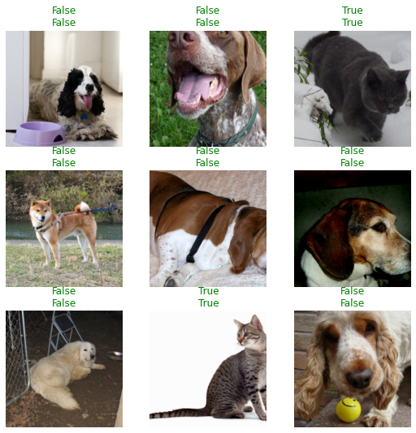

텍스트, 표 형식과 같은 다른 응용 프로그램 또는 이 튜토리얼에서 다루는 다른 문제들을 확인해 보세요. 그러면 모두 일관된 API를 공유하여 데이터를 수집하고 Learner를 생성하고 모델을 훈련시키고 예측하는 것을 볼 수 있습니다.

# 품종 분류하기

데이터에 품종 이름을 붙이기 위해 정규식을 사용하여 파일 이름에서 추출할 것입니다. 파일 이름을 다시 살펴보면 다음과 같습니다.
```
files[0].name
```
```
'great_pyrenees_173.jpg'
```
마지막 앞에는 클래스가 전부이고, 그 뒤에는 몇 자리 숫자가 나옵니다. 이름을 나타내는 정규식은 다음과 같습니다.
```
pat = r'^(.*)_\d+.jpg'
```
정규식을 사용하여 데이터에 레이블을 지정하는 것이 매우 일반적이므로(일반적으로 파일 이름에 레이블이 숨겨져 있음) 다음과 같은 작업을 수행하는 factory method가 있습니다.

```
dls = ImageDataLoaders.from_name_re(path, files, pat, item_tfms=Resize(224))
```

이전과 마찬가지로 show_batch를 사용하여 데이터를 살펴볼 수 있습니다.

```
dls.show_batch()
```

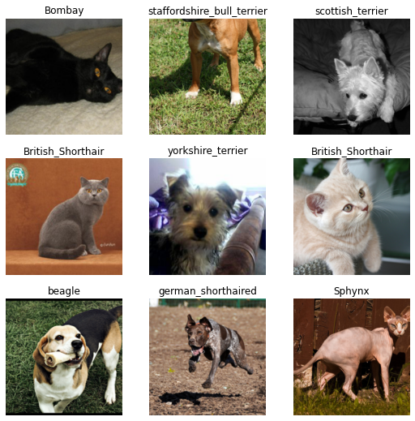

37종의 다른 품종 간에 고양이 또는 개의 정확한 품종을 분류하는 것이 더 어려운 문제이기 때문에 데이터 증가를 사용하기 위해 DataLoader의 정의를 약간 변경할 것입니다.

```
dls = ImageDataLoaders.from_name_re(path, files, pat, item_tfms=Resize(460),
                                    batch_tfms=aug_transforms(size=224))
```

이번에는 일괄적으로 묶기 전에 더 큰 크기로 크기를 조정했으며 batch_tfms를 추가했습니다. aug_transforms는 많은 데이터 세트에서 잘 작동하는 기본값이 포함된 데이터 증강 변환 컬렉션을 제공하는 함수입니다. 적절한 인수를 aug_transforms에 전달하여 이러한 변환을 사용자가 정의할 수 있습니다.
```
dls.show_batch()
```

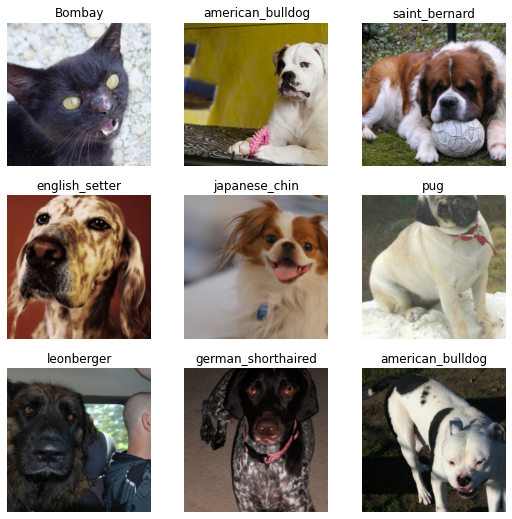

그런 다음 이전과 동일하게 Learner를 만들고 모델을 훈련시킬 수 있습니다.
```
learn = cnn_learner(dls, resnet34, metrics=error_rate)
```

우리는 이전에 기본 학습률을 사용했지만, 가능한 최고의 학습률을 찾고 싶을 수도 있습니다. 이를 위해 학습 속도 측정기를 사용할 수 있습니다.
```
learn.lr_find()
```
```
SuggestedLRs(lr_min=0.010000000149011612, lr_steep=0.0063095735386013985)
```

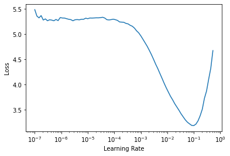

이 그래프는 학습 속도 측정기의 그래프를 표시하고 두 가지 제안(최소를 10으로 나눈 것과 가장 가파른 기울기)을 제공합니다. 여기서는 3e-3을 사용합시다. 또한 좀 더 많은 수의 epoch를 할 것입니다.

```
learn.fine_tune(2, 3e-3)
```

|epoch|train_loss|valid_loss|error_rate|time|
|-----|---|---|---|---|
|0	|1.270041	|0.308686	|0.109608| 00:16|

|epoch|train_loss|valid_loss|error_rate|time|
|-----|---|---|---|---|
|0	|0.468626	|0.355379	|0.117050| 00:21|
|1	|0.418402	|0.384385	|0.110961| 00:20|
|2	|0.267954	|0.220428	|0.075778| 00:21|
|3	|0.143201	|0.203174	|0.064953| 00:20|

show_results를 사용하여 몇 가지 예측을 살펴볼 수 있습니다.
```
learn.show_results()
```

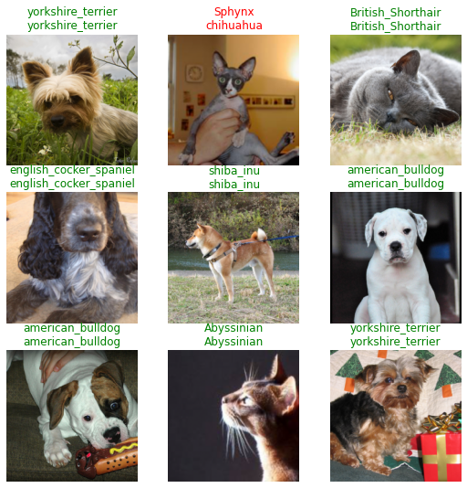

또 다른 유용한 것은 interpretation 객체로서, 모델이 어디에서 더 나쁜 예측을 했는지 보여줄 수 있습니다.
```
interp = Interpretation.from_learner(learn)
```
```
interp.plot_top_losses(9, figsize=(15,10))
```

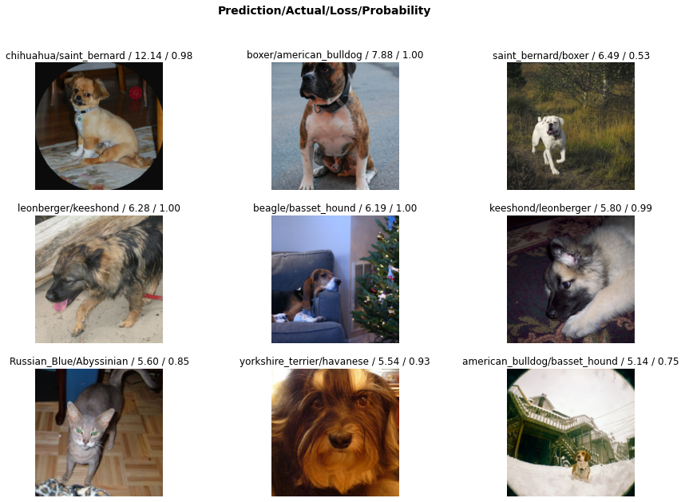

# 단일 레이블 분류 - data block API를 통해

data block API를 사용하여 DataLoader에서 데이터를 가져올 수도 있습니다. 이것은 좀 더 심화된 것이므로, 만약 아직 새로운 API를 배우는 것이 어렵다면 이 부분을 자유롭게 건너뛸 수 있습니다.

datablock은 fastai 라이브러리에 다음과 같은 많은 정보를 제공하여 구축됩니다.

- block이라는 인자를 통해 사용되는 유형: 이미지와 카테고리가 있으므로 ImageBlock과 CategoryBlock을 전달합니다.
- 원시 데이터를 가져오는 방법, 함수 get_image_files.
- 항목에 레이블을 지정하는 방법(여기서는 이전과 동일한 정규식)을 사용합니다.
- 항목들을 분할하는 방법, random splitter.
- item_tfms 및 batch_tfms, 이전과 유사.

```
pets = DataBlock(blocks=(ImageBlock, CategoryBlock), 
                 get_items=get_image_files, 
                 splitter=RandomSplitter(),
                 get_y=using_attr(RegexLabeller(r'(.+)_\d+.jpg$'), 'name'),
                 item_tfms=Resize(460),
                 batch_tfms=aug_transforms(size=224))
```

pets 객체 자체는 비어 있습니다. 데이터 수집에 도움이 되는 기능만 포함되어 있습니다. DataLoaders를 얻으려면 dataloaders 메서드를 호출해야 합니다. 데이터의 출처를 전달합니다.:

```
dls = pets.dataloaders(untar_data(URLs.PETS)/"images")
```
그러면 dls.show_batch()를 통해 사진 몇 장을 볼 수 있습니다.
```
dls.show_batch(max_n=9)
```

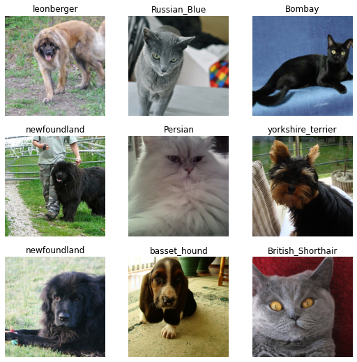


# 다중 레이블 분류

이 작업에서는 다양한 종류의 오브젝트 또는 사람이 포함된 파스칼 데이터셋([Pascal Dataset](http://host.robots.ox.ac.uk/pascal/VOC/))을 사용할 것입니다. 이 데이터셋은 한 가지 종류의 이미지 인스턴스뿐만 아니라 주변의 바운딩 박스까지 탐지할 수 있습니다. 여기에선 주어진 이미지에서 모든 클래스를 예측하고자 합니다.


다중 레이블 분류는 한 가지 분류에만 속하지 않는다는 점에서 single-label classification의 연장선 상에 있습니다. 한 이미지 안에 사람과 말이 함께 있을 수도 있고, 어떠한 범주에도 속하지 않을 수도 있습니다.


이전과 마찬가지로 데이터셋은 매우 쉽게 다운로드 할 수 있습니다:

```python
path = untar_data(URLs.PASCAL_2007)
path.ls()
```
```
(#9) [Path('/home/jhoward/.fastai/data/pascal_2007/valid.json'),Path('/home/jhoward/.fastai/data/pascal_2007/test.json'),Path('/home/jhoward/.fastai/data/pascal_2007/test'),Path('/home/jhoward/.fastai/data/pascal_2007/train.json'),Path('/home/jhoward/.fastai/data/pascal_2007/test.csv'),Path('/home/jhoward/.fastai/data/pascal_2007/models'),Path('/home/jhoward/.fastai/data/pascal_2007/segmentation'),Path('/home/jhoward/.fastai/data/pascal_2007/train.csv'),Path('/home/jhoward/.fastai/data/pascal_2007/train')]
```

각각의 이미지 레이블에 대한 정보는 `train.csv`라는 파일에 담겨 있습니다. pandas를 이용해 불러와 보도록 합시다:
```python
df = pd.read_csv(path/'train.csv')
df.head()
```
||fname|labels|is_valid|
|:---:|:---|:---|:---|
|**0**|000005.jpg|chair|True
|**1**|000007.jpg|car|True
|**2**|000009.jpg|horse person|True
|**3**|000012.jpg|car|False
|**4**|000016.jpg|bicycle|True

## 다중 레이블 분류 - High-level API의 사용
이는 꽤나 직관적입니다: 각각의 파일에 대해 서로 다른 레이블들(스페이스로 분류된)을 얻고 마지막 열은 그 데이터의 검증 집합(validation set) 포함 여부를 알려줍니다. [DataLoaders](https://docs.fast.ai/data.core.html#DataLoaders)에서 이들을 빨리 얻기 위해서 `from_df`라는 팩토리 메소드를 사용합니다. 모든 이미지가 있는 기본 경로, 기본 경로와 파일 이름 사이에 추가할 폴더 (여기선 `train`), 검증 집합을 위한 `valid_col` (지정하지 않은 경우 임의의 하위 집합을 선택), 레이블을 분류하기 위한 `label_delim`, 그리고 이전처럼 `item_tfms`와 `batch_tfms`을 지정할 수 있습니다.

`fn_col`과 `label_col`은 기본적으로 각각 첫 번째 열과 두 번째 열로 설정되므로 따로 지정해줄 필요가 없습니다.

```python
dls = ImageDataLoaders.from_df(df, path, folder='train', valid_col='is_valid', label_delim=' ',
                               item_tfms=Resize(460), batch_tfms=aug_transforms(size=224))
```
이전처럼 `show_batch` 메소드를 통해 데이터를 확인할 수 있습니다.
```python
dls.show_batch()
```


모델을 학습은 이전처럼 하면 쉽습니다: 동일한 함수를 사용할 수 있고 fastai 라이브러리는 자동적으로 multi-label problem을 탐지해줍니다. 따라서 올바른 손실 함수가 선택됩니다. 유일한 차이점은 사용되는 메트릭스입니다:

[error_rate](https://docs.fast.ai/metrics.html#error_rate)는 multi-label problem을 해결해주지 않지만 대신 `accuracy_thresh`를 사용할 수 있습니다.
```python
learn = cnn_learner(dls, resnet50, metrics=partial(accuracy_multi, thresh=0.5))
```
전과 마찬가지로 `learn.lr_find`는 좋은 학습률을 보여줍니다:
```python
learn.lr_find()
```
```
SuggestedLRs(lr_min=0.025118863582611083, lr_steep=0.03981071710586548)
```


다양한 학습률과 잘 조정이 된 학습 모델을 얻을 수 있습니다:
```python
learn.fine_tune(2, 3e-2)
```
|epoch|train_loss|valid_loss|accuracy_multi|time|
|:---|:---|:---|:---|:--|
|0|0.437855|0.136942|0.954801|00:17

|epoch|train_loss|valid_loss|accuracy_multi|time|
|:---|:---|:---|:---|:--|
0|0.156202|0.465557|0.914801|00:20|
1|0.179814|0.382907|0.930040|00:20|
2|0.157007|0.129412|0.953924|00:20|
3|0.125787|0.109033|0.960856|00:19|

결과는 다음과 같습니다:
```python
learn.show_results()
```


또는 주어진 이미지를 통해 추정할 수 있습니다:
```python
learn.predict(path/'train/000005.jpg')
```
```
((#2) ['chair','diningtable'],
 TensorImage([False, False, False, False, False, False, False, False,  True, False,
          True, False, False, False, False, False, False, False, False, False]),
 TensorImage([1.6750e-03, 5.3663e-03, 1.6378e-03, 2.2269e-03, 5.8645e-02, 6.3422e-03,
         5.6991e-03, 1.3682e-02, 8.6864e-01, 9.7093e-04, 6.4747e-01, 4.1217e-03,
         1.2410e-03, 2.9412e-03, 4.7769e-01, 9.9664e-02, 4.5190e-04, 6.3532e-02,
         6.4487e-03, 1.6339e-01]))
```
단일 분류 예측(single classification predictions)에서는 세 가지를 알아냈었습니다. 마지막은 각 클래스에 대한(0에서 1까지) 모델의 추정입니다. 두 번째에서 마지막까지가 원핫(one-hot) 인코딩에 해당하고(확률이 0.5를 초과하면 모든 추정에서 `True`) 첫번째가 읽을 수 있는 버전으로 디코딩됩니다.

이제 어디에서 문제가 발생했는지 확인할 수 있습니다:
```python
interp = Interpretation.from_learner(learn)
interp.plot_top_losses(9)
```
||target|predicted|probabilities|loss|
|:---|:---|:---|:---|:--|
**0**|car;person;tvmonitor|car|tensor([7.2388e-12, 5.9609e-06, 1.7054e-11, 3.8985e-09, 7.7078e-12, 3.4044e-07,\n 9.9999e-01, 7.2118e-12, 1.0105e-05, 3.1035e-09, 2.3334e-09, 9.1077e-09,\n 1.6201e-09, 1.1083e-08, 1.0809e-02, 2.1072e-07, 9.5961e-16, 5.0478e-07,\n 4.4531e-10, 9.6444e-12])|1.494603157043457|
**1**|boat|car|tensor([8.3430e-06, 1.9416e-03, 6.9865e-06, 1.2985e-04, 1.6142e-06, 8.2200e-05,\n 9.9698e-01, 1.3143e-06, 1.0047e-03, 4.9794e-05, 1.9155e-05, 4.7409e-05,\n 7.5056e-05, 1.6572e-05, 3.4760e-02, 6.9266e-04, 1.3006e-07, 6.0702e-04,\n 1.5781e-05, 1.9860e-06])|0.7395917773246765
**2**|bus;car|car|tensor([2.2509e-11, 1.0772e-05, 6.0177e-11, 4.8728e-09, 1.7920e-11, 4.8695e-07,\n 9.9999e-01, 9.0638e-12, 1.9819e-05, 8.8023e-09, 5.1272e-09, 2.3535e-08,\n 6.0401e-09, 7.2609e-09, 4.4117e-03, 4.8268e-07, 1.2528e-14, 1.2667e-06,\n 8.2282e-10, 1.6300e-11])|0.7269787192344666|
**3**|chair;diningtable;person|person;train|tensor([1.6638e-03, 2.0881e-02, 4.7525e-03, 2.6422e-02, 6.2972e-04, 4.7170e-02,\n 1.2263e-01, 2.9744e-03, 5.5352e-03, 7.1830e-03, 1.0062e-03, 2.6123e-03,\n 1.8208e-02, 5.9618e-02, 7.6859e-01, 3.3504e-03, 1.1324e-03, 2.3881e-03,\n 6.5440e-01, 1.7040e-03])|0.6879587769508362|
**4**|boat;chair;diningtable;person|person|tensor([0.0058, 0.0461, 0.0068, 0.1083, 0.0094, 0.0212, 0.4400, 0.0047, 0.0166,\n 0.0054, 0.0030, 0.0258, 0.0020, 0.0800, 0.5880, 0.0147, 0.0026, 0.1440,\n 0.0219, 0.0166])|0.6826764941215515|
**5**|bicycle;car;person|car|tensor([3.6825e-09, 7.3755e-05, 1.7181e-08, 4.5056e-07, 3.5667e-09, 1.0882e-05,\n 9.9939e-01, 6.0704e-09, 5.7179e-05, 3.8519e-07, 9.3825e-08, 6.1463e-07,\n 3.9191e-07, 2.6800e-06, 3.3091e-02, 3.1972e-06, 2.6873e-11, 1.1967e-05,\n 1.1480e-07, 3.3320e-09])|0.6461981534957886|
**6**|bottle;cow;person|chair;person;sofa|tensor([5.4520e-04, 4.2805e-03, 2.3828e-03, 1.4127e-03, 4.5856e-02, 3.5540e-03,\n 9.1525e-03, 2.9113e-02, 6.9326e-01, 1.0407e-03, 7.0658e-02, 3.1101e-02,\n 2.4843e-03, 2.9908e-03, 8.8695e-01, 2.2719e-01, 1.0283e-03, 6.0414e-01,\n 1.3598e-03, 5.7382e-02])|0.6329519152641296|
**7**|chair;dog;person|cat|tensor([3.4073e-05, 1.3574e-03, 7.0516e-04, 1.9189e-04, 6.0819e-03, 4.7242e-05,\n 9.6424e-04, 9.3669e-01, 9.0736e-02, 8.1472e-04, 1.1019e-02, 5.4633e-02,\n 2.6190e-04, 1.4943e-04, 1.2755e-02, 1.7530e-02, 2.2532e-03, 2.2129e-02,\n 1.5532e-04, 6.6390e-03])|0.6249645352363586|
**8**|car;person;pottedplant|car|tensor([1.3978e-06, 2.1693e-03, 2.2698e-07, 7.5037e-05, 9.4007e-07, 1.2369e-03,\n 9.9919e-01, 1.0879e-07, 3.1837e-04, 1.8340e-05, 7.5422e-06, 2.3891e-05,\n 2.5957e-05, 3.0890e-05, 8.4529e-02, 2.0280e-04, 4.1234e-09, 1.7978e-04,\n 2.3258e-05, 6.0897e-07])|0.5489450693130493|


## 다중 레이블 분류 - 데이터 블럭 API를 통해
[DataLoaders](https://docs.fast.ai/data.core.html#DataLoaders)에서 데이터를 얻기 위해 데이터 블럭 API를 사용할 수 있습니다. 전에서 언급했다시피 아직 새로운 API에 대해 배우기가 힘들다면 이 파트는 넘어가도 괜찮습니다.

데이터프레임에서 데이터가 어떻게 구조화되어 있는지 생각해봅시다:
```python
df.head()
```
||fname|labels|is_valid|
|:---:|:---|:---|:---|
|**0**|000005.jpg|chair|True
|**1**|000007.jpg|car|True
|**2**|000009.jpg|horse person|True
|**3**|000012.jpg|car|False
|**4**|000016.jpg|bicycle|True

이 경우에는 다음을 통해 데이터 블록을 구축합니다:

- 사용되는 방법: [ImageBlock](https://docs.fast.ai/vision.data.html#ImageBlock)과 [MultiCategoryBlock](https://docs.fast.ai/data.block.html#MultiCategoryBlock).
- 데이터 프레임에서 입력 항목을 가져오는 방법: 여기서는 `fname` 열을 읽고 적절한 파일 이름을 얻으려면 처음에 path/train/을 추가해야 합니다.
- 데이터 프레임에서 대상을 가져오는 방법: 여기서는 `labels`을 읽고 공백을 기준으로 분할해야 합니다.
- `is_valid`를 통해 항목들을 나눌 수 있습니다.
- `item_tfms`와 `batch_tfms`는 이전과 같습니다.
```python
pascal = DataBlock(blocks=(ImageBlock, MultiCategoryBlock),
                   splitter=ColSplitter('is_valid'),
                   get_x=ColReader('fname', pref=str(path/'train') + os.path.sep),
                   get_y=ColReader('labels', label_delim=' '),
                   item_tfms = Resize(460),
                   batch_tfms=aug_transforms(size=224))
```
이 부분은 지금까지와는 조금 다릅니다: 우리가 제공할 데이터 프레임은 이미 모든 항목을 가지고 있기 때문에 모든 항목을 수집하는 기능을 사용할 필요가 없습니다. 그러나 인풋을 가져오려면 해당 데이터 프레임의 행을 전처리해야 하므로 `get_x`를 사용해야 합니다. fastai function 에서 기본으로 제공되는 `noop`을 사용하면 됩니다.

`pascal`은 초안일 뿐입니다. [DataLoaders](https://docs.fast.ai/data.core.html#DataLoaders)를 사용하려면 데이터 소스를 전송해야 합니다:
```python
dls = pascal.dataloaders(df)
```
그러면 `dls.show_batch()`를 통해 몇몇 사진들을 확인할 수 있습니다.
```python
dls.show_batch(max_n=9)
```


# 분할 추출

분할 추출은 이미지의 각 픽셀을 가리키는 항목을 예측하는 것에 어려움이 있습니다. 이 작업을 위해 자동차를 찍은 이미지를 데이터로 가지고 있는 [Camvid dataset](http://mi.eng.cam.ac.uk/research/projects/VideoRec/CamVid/) 을 사용할 것입니다. 이미지의 각 픽셀은 "road", "car", "pedestrian 와 같은 레이블을 가지고 있습니다.

[untar_data](https://docs.fast.ai/data.external.html#untar_data) 함수를 이용해서 데이터를 다운로드 할 수 있습니다.

```
path = untar_data(URLs.CAMVID_TINY)
path.ls()
```
```
(#3) [Path('/home/jhoward/.fastai/data/camvid_tiny/codes.txt'),Path('/home/jhoward/.fastai/data/camvid_tiny/images'),Path('/home/jhoward/.fastai/data/camvid_tiny/labels')]
```

images 폴더는 이미지를 포함하고 있고, 그에 따른 분할 추출 마스크의 항목은 labels 폴더 안에 있습니다. codes 파일에는 클래스에 따른 정수 값이 들어 있습니다.
```
codes = np.loadtxt(path/'codes.txt', dtype=str)
codes
```
```
array(['Animal', 'Archway', 'Bicyclist', 'Bridge', 'Building', 'Car',
       'CartLuggagePram', 'Child', 'Column_Pole', 'Fence', 'LaneMkgsDriv',
       'LaneMkgsNonDriv', 'Misc_Text', 'MotorcycleScooter', 'OtherMoving',
       'ParkingBlock', 'Pedestrian', 'Road', 'RoadShoulder', 'Sidewalk',
       'SignSymbol', 'Sky', 'SUVPickupTruck', 'TrafficCone',
       'TrafficLight', 'Train', 'Tree', 'Truck_Bus', 'Tunnel',
       'VegetationMisc', 'Void', 'Wall'], dtype='<U17')
```

# 분할 추출 – 높은 수준의 API를 이용하는 경우
이전처럼 [get_image_files](https://docs.fast.ai/data.transforms.html#get_image_files) 함수는 모든 이미지 파일이름을 불러올 수 있게 합니다:
```
fnames = get_image_files(path/"images")
fnames[0]
```
```
Path('/home/jhoward/.fastai/data/camvid_tiny/images/0006R0_f02910.png')
```
레이블 폴더를 자세히 살펴보면:
```
(path/"labels").ls()[0]
```
```
Path('/home/jhoward/.fastai/data/camvid_tiny/labels/0016E5_08137_P.png')
```
분할 추출 마스크가 이미지들의 기본 이름에 _P를 한 것과 같다고 할 수 있기 때문에, 아래처럼 레이블 함수를 정의할 수 있습니다:
```
def label_func(fn): return path/"labels"/f"{fn.stem}_P{fn.suffix}"
```
그렇게 하면 SegmentationDataLoaders를 사용해서 데이터를 얻을 수 있습니다:
```
dls = SegmentationDataLoaders.from_label_func(
    path, bs=8, fnames = fnames, label_func = label_func, codes = codes
)
```

모든 이미지가 같은 크기이기 때문에 이미지의 크기를 재조정하기 위해 item_tfms을 넘길 필요가 없습니다.

 show_batch 함수를 이용하면 이미지 데이터를 확인할 수 있습니다. 이 사례에서는, fastai library가 픽셀당 하나의 특정 색상으로 마스크를 중첩하고 있습니다:
 ```
dls.show_batch(max_n=6)
```
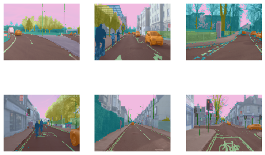

기존의CNN 은 분할 추출 시에 작동하지 않기 때문에, UNet이라는 특별한 모델을 사용해야 해서, Learner을 정의하기 위해unet_learner 을 사용합니다:
```
learn = unet_learner(dls, resnet34)
learn.fine_tune(6)
```
|epoch|train_loss|valid_loss|time|
|-----|---|---|---|
|0	|2.802264	|2.476579	|00:03|
|epoch	|train_loss	|valid_loss	|time|
|0	|1.664625	|1.525224	|00:03|
|1	|1.440311	|1.271917	|00:02|
|2	|1.339473	|1.123384	|00:03|
|3	|1.233049	|0.988725	|00:03|
|4	|1.110815	|0.805028	|00:02|
|5	|1.008600	|0.815411	|00:03|
|6	|0.924937	|0.755052	|00:02|
|7	|0.857789	|0.769288	|00:03|

show_results를 통해 예측된 결과에서 특징을 얻을 수 있습니다.
```
learn.show_results(max_n=6, figsize=(7,8))
 ```
 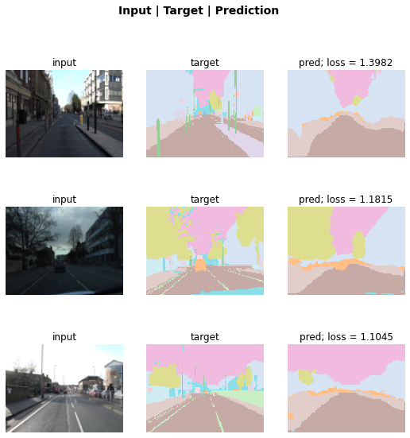
 
[SegmentationInterpretation](https://docs.fast.ai/interpret.html#SegmentationInterpretation) 클래스를 사용하여 모델의 오류를 정렬한 후 검증 손실에 대해 k개의 가장 높은 기여도를 가진 사례를 구성할 수 있습니다.
```
interp = SegmentationInterpretation.from_learner(learn)
interp.plot_top_losses(k=3)
```
 
 
# 분할 추출 – 데이터 블록 API를 사용할 경우
[DataLoaders](https://docs.fast.ai/data.core.html#DataLoaders) 안에 있는 데이터를 얻기 위해 데이터 블록 API를 사용할 수도 있습니다. 전에 언급했듯이, 아직 새로운 API를 배우는 것이 익숙하지 않다면 이 부분을 건너 뛰어도 됩니다.

이 경우 다음과 같은 것을 제공하여 데이터 블록을 구성합니다:
•	사용된 유형: [ImageBlock](https://docs.fast.ai/vision.data.html#ImageBlock) 과  [MaskBlock](https://docs.fast.ai/vision.data.html#MaskBlock). 데이터레서 추측할 수 있는 방법이 없으므로 [MaskBlock](https://docs.fast.ai/vision.data.html#MaskBlock) 에서 코드를 제공.
•	정보를 모으는 방법: [get_image_files](https://docs.fast.ai/data.transforms.html#get_image_files).
•	정보로부터 목표 데이터를 얻는 방법: label_func.
•	정보 분리는 무작위로 진행.
•	batch_tfms 는 데이터 증가를 위해 사용.
```
camvid = DataBlock(blocks=(ImageBlock, MaskBlock(codes)),
                   get_items = get_image_files,
                   get_y = label_func,
                   splitter=RandomSplitter(),
                   batch_tfms=aug_transforms(size=(120,160)))
dls = camvid.dataloaders(path/"images", path=path, bs=8)
dls.show_batch(max_n=6)
```
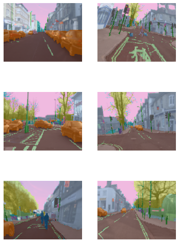

# 포인트
이 섹션은 데이터 블록 API를 사용하므로 이전에 건너뛰었다면 이 섹션도 건너뛰는 것을 권장 드립니다.
이제 그림에서 포인트를 예측하는 작업을 살펴보겠습니다. 이 과정을 위해[Biwi Kinect Head Pose Dataset](Biwi Kinect Head Pose Dataset)을 사용할 것입니다. 먼저 평소와 같이 데이터 셋을 다운로드하여 시작하겠습니다.
```
path = untar_data(URLs.BIWI_HEAD_POSE)
```
어떤 결과가 나왔는지 확인해 보겠습니다!
```
path.ls()
```
```
(#50) [Path('/home/sgugger/.fastai/data/biwi_head_pose/01.obj'),Path('/home/sgugger/.fastai/data/biwi_head_pose/18.obj'),Path('/home/sgugger/.fastai/data/biwi_head_pose/04'),Path('/home/sgugger/.fastai/data/biwi_head_pose/10.obj'),Path('/home/sgugger/.fastai/data/biwi_head_pose/24'),Path('/home/sgugger/.fastai/data/biwi_head_pose/14.obj'),Path('/home/sgugger/.fastai/data/biwi_head_pose/20.obj'),Path('/home/sgugger/.fastai/data/biwi_head_pose/11.obj'),Path('/home/sgugger/.fastai/data/biwi_head_pose/02.obj'),Path('/home/sgugger/.fastai/data/biwi_head_pose/07')...]
```
24개의 주소가 01부터 24까지로 구별되어 있고 (각각 다른 사람의 사진으로 구별) 그에 따른 .obj 파일도 있다 (여기에서는 사용되지 않는다). 이 주소들 중 하나를 살펴보도록 하겠다:
```
(path/'01').ls()
```
```
(#1000) [Path('01/frame_00087_pose.txt'),Path('01/frame_00079_pose.txt'),Path('01/frame_00114_pose.txt'),Path('01/frame_00084_rgb.jpg'),Path('01/frame_00433_pose.txt'),Path('01/frame_00323_rgb.jpg'),Path('01/frame_00428_rgb.jpg'),Path('01/frame_00373_pose.txt'),Path('01/frame_00188_rgb.jpg'),Path('01/frame_00354_rgb.jpg')...]
```
하위 디렉토리 내부에는, 각기 다른 프레임과, 프레임 별로 이미지(\_rgb.jpg)와 포즈 파일(\_pose.txt)이 함께 제공됩니다. [get_image_files](https://docs.fast.ai/data.transforms.html#get_image_files) 을 사용하여 모든 이미지 파일을 재귀적으로 쉽게 가져온 다음 이미지 파일 이름을 연결된 포즈 파일로 변환하는 함수를 작성할 수 있습니다.
```
img_files = get_image_files(path)
def img2pose(x): return Path(f'{str(x)[:-7]}pose.txt')
img2pose(img_files[0])
```
```
Path('04/frame_00084_pose.txt')
```
첫 번째 이미지 확인 방법:
```
im = PILImage.create(img_files[0])
im.shape
```
```
(480, 640)
```
```
im.to_thumb(160)
```
 
 
Biwi 데이터 셋 웹사이트에서는 중심점의 위치를 보여주는 각 이미지와 관련된 포즈 텍스트 파일의 형식을 설명해주고 있습니다. 이것의 세부 사항은 우리의 목적에 중요하지 않으므로 중심점을 추출하는데 사용되는 함수를 사용해야 합니다:
```
cal = np.genfromtxt(path/'01'/'rgb.cal', skip_footer=6)
def get_ctr(f):
    ctr = np.genfromtxt(img2pose(f), skip_header=3)
    c1 = ctr[0] * cal[0][0]/ctr[2] + cal[0][2]
    c2 = ctr[1] * cal[1][1]/ctr[2] + cal[1][2]
    return tensor([c1,c2])
```
이 함수는 좌표를 두 항목의 텐서로 반환합니다:
```
get_ctr(img_files[0])
```
```
tensor([372.4046, 245.8602])
```
이 함수는 각 항목에 레이블을 지정하는 역할을 하기 [DataBlock](https://docs.fast.ai/data.block.html#DataBlock) 에 get_y로 전달할 수 있습니다. 또한 훈련 속도를 조금 높이기 위해 이미지 크기를 입력 크기의 절반으로 조정하겠습니다.

한 가지 주의할 점은 무작위로 흩어서는 안 된다는 것입니다. 그 이유는 동일한 사람이 데이터 셋의 여러 이미지에 나타나기 때문인데—하지만 우리는 모델을 아직 이미지를 본 적 없는 사람들에게도 일반화해서 적용하고 싶기 때문이다. 데이터 셋의 각 폴더에는 한 사람의 이미지가 포함되어 있습니다. 따라서 한 사람에 대해서만 true를 반환하는 splitter함수를 생성하여 그 사람의 이미지만 포함하는 유효성 검사 셋을 생성할 수 있습니다.

이전 데이터 블록 예제와 다른 유일한 차이점은 두번째 블록이 PointBlock 이라는 점입니다. 이것은 fastai가 레이블이 좌표를 나타낸다는 것을 알기 위해서 필요하기 때문에 데이터 증가를 수행할 때 이미지에 대해 수행하는 것처럼 이러한 좌표에 대해 동일한 증가를 수행해야 한다는 것을 알려줍니다.
```
biwi = DataBlock(
    blocks=(ImageBlock, PointBlock),
    get_items=get_image_files,
    get_y=get_ctr,
    splitter=FuncSplitter(lambda o: o.parent.name=='13'),
    batch_tfms=[*aug_transforms(size=(240,320)), 
                Normalize.from_stats(*imagenet_stats)]
)
dls = biwi.dataloaders(path)
dls.show_batch(max_n=9, figsize=(8,6))
```
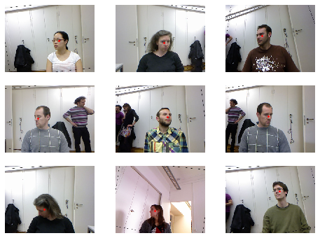

이렇게 데이터들을 다 모으면, 이제 나머지 fastai API를 사용할 수 있습니다. [cnn_learner](https://docs.fast.ai/vision.learner.html#cnn_learner) 는 이 경우에 완벽히 작동하며, 라이브러리는 데이터에서 적절한 손실 함수를 추론하게 됩니다:
```
learn = cnn_learner(dls, resnet18, y_range=(-1,1))
learn.lr_find()
```
```
(0.005754399299621582, 3.6307804407442745e-07)
```
 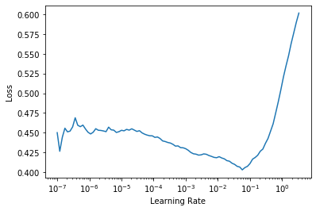
 
이제 모델을 학습시킬 수 있습니다:
```
learn.fine_tune(1, 5e-3)
```
|epoch	|train_loss	|valid_loss	|time|
|-----|---|---|---|
|0	|0.057434	|0.002171	|00:31|
|epoch	|train_loss	|valid_loss	|time|
|0	|0.005320	|0.005426	|00:39|
|1	|0.003624	|0.000698	|00:39|
|2	|0.002163	|0.000099	|00:39|
|3	|0.001325	|0.000233	|00:39|

손실은 평균 제곱 오차이므로 포인트를 예측할 때 평균적으로 퍼센트 오차가 발생합니다.
```
math.sqrt(0.0001)
```
```
0.01
```
최종적인 결과입니다:
```
learn.show_results()
```
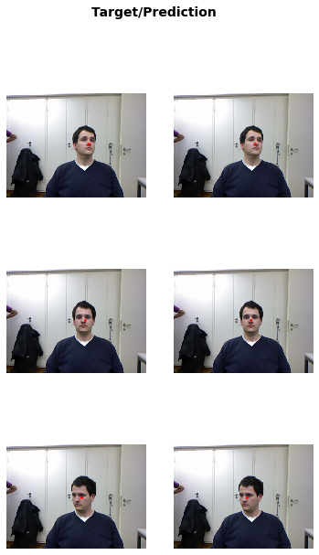

